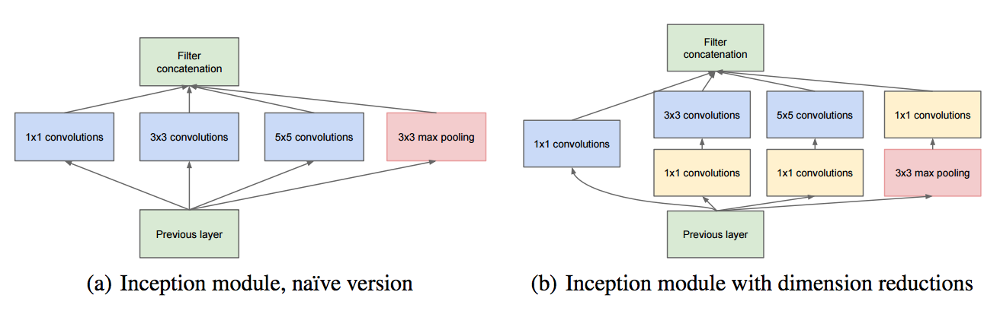

### Introduction ###
`Inception Model (a.k.a GoogLeNet)` is a model which won the 1st prize in `ImageNet Large Scale Visual Recognition Challenge (ILSVRC)` in 2014. In general, the deeper the network, the more layers you have, the better the performance. However, the problem is that as the network becomes deeper, the number of parameters increases. Motivation for `Inception Model` was to generate feature maps using several alternatives together. `Inception Model` looks like below:

The `Inception Model` used a `1x1 Convolutional Network`. `1x1 Conv` does not affect `H`, `W`, but reduces the number of `Channels`, which leads to the effect of dimension reduction. This increases the accuracy of the model and reduces the amount of computation. The input size of `AlexNet` is `(3, 224, 224)`, but `MNIST Dataset` is `(1, 28, 28)`. Therefore, you will implement `Simplified Inception`.

### Importing various libraries 

~~~ python
import torch
import torch.nn as nn
import torch.optim as optim
from torch.utils.data import DataLoader
import torchvision.datasets as dset
import torchvision.transforms as T
import matplotlib.pyplot as plt
~~~

---
### Data

~~~ python
batch_size = 64

mnist_train = dset.MNIST('../input', train=True, download=True, transform=T.ToTensor())
loader_train = DataLoader(mnist_train, batch_size=batch_size, shuffle=True)
mnist_test = dset.MNIST('../input', train=False, download=True, transform=T.ToTensor())
loader_test = DataLoader(mnist_test, batch_size=batch_size, shuffle=False)

~~~
---
### Model

We provide `SimplifiedInception.pdf` file. Refer to this, and implement the model.

~~~ python
class Flatten(nn.Module):
    def forward(self, x):
        N, C, H, W = x.size()
        return x.view(N, -1)

class InceptionA(nn.Module):
    def __init__(self, in_channels):
        super(InceptionA, self).__init__()
        # To be implemented
        self.incep1 = nn.Conv2d(in_channels, 2, kernel_size = 1)
        self.incep2 = nn.Sequential(
            nn.Conv2d(in_channels, 2, kernel_size=1),
            nn.Conv2d(2,3,kernel_size = 3, padding = 1)
        )
        self.incep3 = nn.Sequential(
            nn.Conv2d(in_channels, 2, kernel_size=1),
            nn.Conv2d(2,3,kernel_size = 5, padding = 2)
        )
        self.incep4 = nn.Sequential(
            nn.Conv2d(in_channels, 2, kernel_size=1, padding=1),
            nn.MaxPool2d(kernel_size=3, stride=1)
        )

    def forward(self, x):
        # To be implemented
        x1 = self.incep1(x)
        x2 = self.incep2(x)
        x3 = self.incep3(x)
        x4 = self.incep4(x)
        return torch.cat([x1,x2,x3,x4],1)
    

class Model(nn.Module):
    def __init__(self):
        super(Model, self).__init__()
        self.net = nn.Sequential(
            nn.Conv2d(1,5,kernel_size=5),
            nn.MaxPool2d(kernel_size=2, stride=2),
            nn.ReLU(inplace=True),
            InceptionA(5),
            
            nn.Conv2d(10,12,kernel_size=5),
            nn.MaxPool2d(kernel_size=2, stride=2),
            nn.ReLU(inplace=True),
            InceptionA(12),
            
            Flatten(),
            nn.Linear(160, 10)
        )

    def forward(self, x):
        return self.net(x)

model = Model().cuda()
~~~

